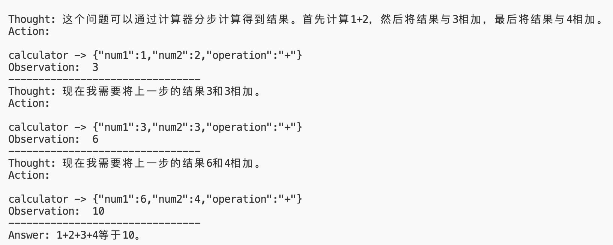
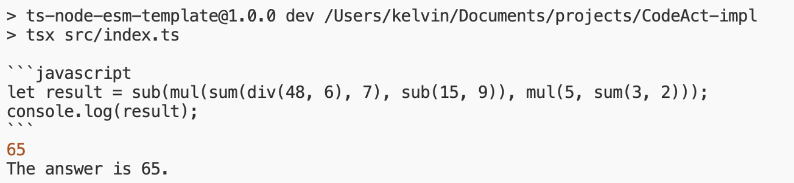

# ReAct & CodeAct

- 代码实现
- **ReAct**: https://github.com/KelvinQiu802/ReAct-impl
- **CodeAct**: https://github.com/KelvinQiu802/CodeAct-impl

## ReAct

*6 Oct 2022* 

Reasoning + Acting

- https://react-lm.github.io/
- https://arxiv.org/abs/2210.03629#:~:text=,this%20version%2C%20v3
- https://github.com/ysymyth/ReAct/blob/master/hotpotqa.ipynb
- 提示词技巧 -> 缺乏对输出的约束



## OpenAI Function Calling

*June 13, 2023*

JSON Structured Output

- [https://openai.com/index/function-calling-and-other-api-updates/](https://openai.com/index/function-calling-and-other-api-updates/)
- 通过模型微调，不再完全依赖提示词工程

## CodeAct

*July 2024*

Running Code

- https://github.com/xingyaoww/code-act
- https://www.youtube.com/watch?v=n5K2fjlT0FQ
- https://machinelearning.apple.com/research/codeact
- https://x.com/peakji/status/1899005201778086166
- https://gist.github.com/renschni/4fbc70b31bad8dd57f3370239dccd58f
- https://github.com/langchain-ai/langgraph-codeact/tree/harrison/some-changes
- 直接输出代码
- 随意调用Python库，减少工具定义
- 随意组合工具，一次完成复杂的工具调用（比如计算一个很长的算式）
- 相比固定的函数集，代码的表达能力几乎无限制



## ReAct System Prompt

```
You run in a loop of Thought, Action, Observation.
At the end of the loop you outputan Answer

- Use Thought to describe your thoughts about the question you have been asked.
- Use Action to run one of the actions available to you。
- Observation will be the result of running those actions.

Example:

Question: What is the capital of Australia?
Thought: I can look up Australia on Google
Action: call_google: Australia

You will be called again with this:

Observation: Australia is a country. The capital is Canberra.

You then output:

Answer: The capital of Australia is Canberra
```

```
(48÷6+7)×(15−9)−5×(3+2)
```

## CodeAct System Prompt

```
You will be given a task to perform. You should output either
- a JavaScript code snippet that provides the solution to the task, or a step towards the solution. Any output you want to extract from the code should be console.log to the console. Code should be output in a fenced code block.
- text to be shown directly to the user, if you want to ask for more information or provide the final answer.
- Only JavaScript code block is valid

In addition to the JavaScript Standard Library, you can use the following functions:

sum(a: number, b:number):number; // a + b
sub(a: number, b:number):number; // a - b
mul(a: number, b:number):number; // a * b
div(a: number, b:number):number; // a / b
```
